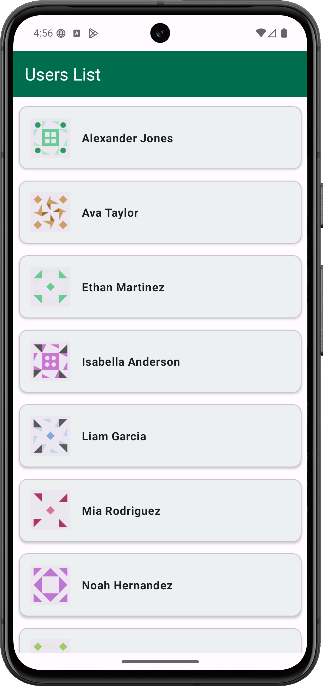
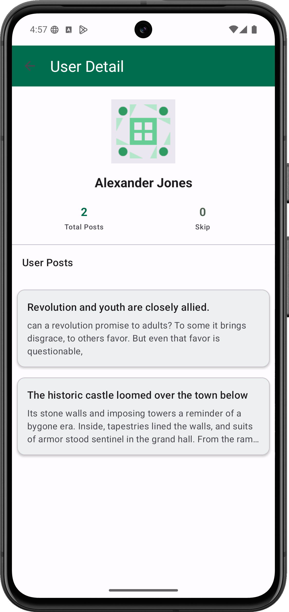
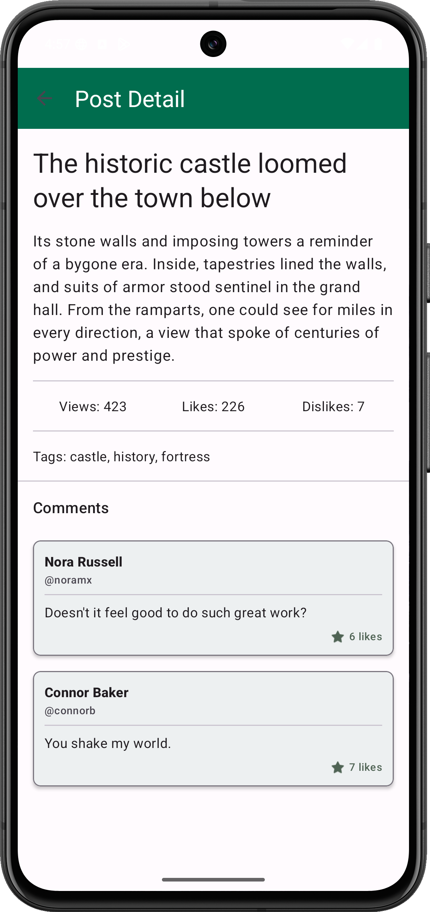

# Posts App 📱

A modern Android application for browsing users, their posts, and post comments with a clean architecture and Material Design 3 UI.

## 📋 Table of Contents

- [Features](#features)
- [Technologies Used](#technologies-used)
- [Project Structure](#project-structure)
- [Architecture](#architecture)
- [Screenshots](#screenshots)
- [Installation](#installation)
- [Usage](#usage)
- [API Integration](#api-integration)
- [Contributing](#contributing)
- [License](#license)

## ✨ Features

- **User List**: Browse all users in a RecyclerView
- **User Details**: View user information with their profile image
- **User Posts**: Display all posts created by a specific user
- **Post Details**: View complete post information including:
  - Post title and body
  - View count, likes, and dislikes
  - Tags/categories
  - Comments section
- **Comments**: View and display all comments for a post with user information
- **Loading States**: Progress bars and dialogs for loading feedback
- **Error Handling**: User-friendly error messages for failed operations
- **Empty States**: Appropriate UI for when no data is available
- **Edge-to-Edge Display**: Modern Material Design 3 edge-to-edge support

## 🛠 Technologies Used

### Core Android
- **Kotlin** - Programming language
- **Android SDK 30+ (Target: 36)** - Android framework
- **Jetpack Components**:
  - **AndroidX AppCompat** - Backward compatibility for app bar and navigation
  - **AndroidX Activity** - Activity lifecycle management
  - **AndroidX Lifecycle** - ViewModel and LiveData for reactive UI
  - **View Binding** - Type-safe view references

### Architecture & Design Patterns
- **Clean Architecture** - Separation of concerns with data, domain, and presentation layers
- **MVVM** - Model-View-ViewModel pattern for UI state management
- **Repository Pattern** - Abstraction of data sources
- **ViewModel** - Lifecycle-aware data holder

### Networking
- **Retrofit** - REST API client
- **OkHttp** - HTTP client with logging interceptor
- **Gson** - JSON serialization/deserialization

### Concurrency
- **Kotlin Coroutines** - Asynchronous programming
  - `coroutines-core` - Core coroutines functionality
  - `coroutines-android` - Main dispatcher for Android

### UI & Design
- **Material Design 3** - Modern Material Design components and theming
- **RecyclerView** - Efficient list display
- **CardView** - Card-based UI components
- **Glide** - Image loading and caching
- **Lottie** - Animation library for sophisticated animations

### Testing
- **JUnit** - Unit testing framework
- **AndroidX Test** - Android instrumentation testing

## 🏗 Project Structure

```
Posts/
├── app/
│   ├── src/
│   │   └── main/
│   │       ├── java/com/intercom/posts/
│   │       │   ├── data/              # Data layer
│   │       │   │   ├── api/           # API definitions and clients
│   │       │   │   ├── model/         # Data models
│   │       │   │   └── repository/    # Repository implementations
│   │       │   │
│   │       │   ├── domain/            # Domain layer
│   │       │   │   └── model/         # Domain models (DTOs)
│   │       │   │
│   │       │   └── presentation/      # Presentation layer (MVVM)
│   │       │       ├── activities/    # Activities
│   │       │       ├── adapter/       # RecyclerView adapters
│   │       │       ├── viewmodel/     # ViewModels
│   │       │       ├── uiState/       # UI state management
│   │       │       ├── utils/         # Utility classes
│   │       │       └── helper/        # Helper classes
│   │       │
│   │       └── res/
│   │           ├── layout/            # XML layouts
│   │           ├── values/            # Resources (strings, colors, themes)
│   │           └── drawable/          # Drawable resources
│   │
│   └── build.gradle.kts               # App-level dependencies
│
├── build.gradle.kts                   # Project-level configuration
├── settings.gradle.kts                # Gradle settings
└── README.md                          # This file
```

## 🏛 Architecture

### Clean Architecture with MVVM

```
┌─────────────────────┐
│  Presentation Layer │
│   (UI & MVVM)       │
├─────────────────────┤
│   Domain Layer      │
│  (Business Logic)   │
├─────────────────────┤
│   Data Layer        │
│ (API & Repository)  │
└─────────────────────┘
```

#### Layers:

1. **Presentation Layer**
   - Activities: MainActivity, UserDetailActivity, PostDetailsActivity
   - ViewModels: UsersViewModel, PostsViewModel, CommentsViewModel
   - Adapters: UsersAdapter, PostsAdapter, CommentsAdapter
   - UI State: UiState sealed class for state management

2. **Domain Layer**
   - DTOs (Data Transfer Objects) for API responses
   - Contains business logic models

3. **Data Layer**
   - Retrofit API clients for HTTP requests
   - Repository pattern for data access
   - Local and remote data sources

## 📸 Screenshots

Screenshots can be added to this README to showcase the app's UI. Here's how to include them:

### To Add Screenshots:

1. **Create a `screenshots` folder** in your project root:
   ```bash
   mkdir screenshots
   ```

2. **Add your screenshots** to this folder (PNG, JPG, or GIF format)

3. **Link them in this README** using one of the following formats:

#### Option 1: Side-by-side layout
```markdown
| Screen | Description |
|--------|-------------|
|  | Display list of users |
|  | User profile and posts |
|  | Full post with comments |
```

#### Option 2: Individual sections
```markdown
### Main Screen

*List of all users with loading and error states*

### User Details

*User profile with image and posts list*

### Post Details

*Post with comments and detailed information*
```

#### Option 3: Carousel style
```markdown
## App Screens

<div align="center">
  
  
  
</div>
```

### Current UI Screens:

1. **MainActivity** - User List Screen
   - RecyclerView displaying all users
   - User profile image and name
   - Loading dialog and error handling

2. **UserDetailActivity** - User Profile Screen
   - User name and profile image
   - Total posts and skip count stats
   - RecyclerView of user's posts

3. **PostDetailsActivity** - Post Details Screen
   - Post title and body content
   - View count, likes, dislikes
   - Tags/categories
   - Comments section with loading state
   - Comments RecyclerView

## 💻 Installation

### Prerequisites
- Android Studio Arctic Fox or later
- Android SDK 30+ 
- Kotlin 1.9+
- Java 11+

### Steps

1. **Clone the repository**
   ```bash
   git clone https://github.com/yourusername/posts-app.git
   cd posts-app
   ```

2. **Open in Android Studio**
   - File → Open → Select the project folder
   - Android Studio will automatically download dependencies

3. **Build the project**
   ```bash
   ./gradlew build
   ```

4. **Run the app**
   - Connect an Android device (API 30+) or use an emulator
   - Click Run → Run 'app'

## 🚀 Usage

### Main Features Walkthrough

#### 1. Browse Users
- Launch the app to see the list of all users
- Each user item shows their profile image and name

#### 2. View User Details
- Tap on any user to view their profile
- See user information and total posts count
- Browse all posts created by this user

#### 3. View Post Details
- Tap on any post to view full details
- See:
  - Post title and body content
  - View count, likes, and dislikes
  - Tags associated with the post
  - All comments with user information

#### 4. Handle Different States
- **Loading**: Shows progress dialog while fetching data
- **Success**: Displays the requested data
- **Error**: Shows error message if something goes wrong
- **Empty**: Shows "No comments found" when applicable

## 🔌 API Integration

### Base URL
The app connects to a REST API for fetching users, posts, and comments.

### Endpoints Used

1. **Get All Users**
   ```
   GET /users
   ```

2. **Get User Posts**
   ```
   GET /posts/user/{userId}
   ```

3. **Get Post Comments**
   ```
   GET /comments/post/{postId}
   ```

### Response Models

#### User Response
```json
{
  "id": 1,
  "firstName": "John",
  "lastName": "Doe",
  "image": "https://example.com/image.jpg"
}
```

#### Post Response
```json
{
  "id": 1,
  "title": "Post Title",
  "body": "Post content...",
  "userId": 1,
  "tags": ["tag1", "tag2"],
  "reactions": {
    "likes": 100,
    "dislikes": 5
  },
  "views": 1000
}
```

#### Comment Response
```json
{
  "id": 1,
  "body": "Comment text...",
  "postId": 1,
  "likes": 10,
  "user": {
    "id": 1,
    "username": "john_doe",
    "fullName": "John Doe"
  }
}
```

## 🎨 UI/UX Features

- **Material Design 3** - Modern, clean UI with Material components
- **Edge-to-Edge Display** - App extends to screen edges for immersive experience
- **State Management** - Clear visual feedback for loading, success, and error states
- **Responsive Design** - Adapts to different screen sizes
- **Image Loading** - Efficient image loading with Glide
- **Smooth Animations** - Lottie animations for loading dialogs

## 📝 Code Quality

- **MVVM Architecture** - Clear separation of concerns
- **Kotlin Coroutines** - Modern asynchronous programming
- **View Binding** - Type-safe view references
- **Resource Management** - Proper lifecycle management
- **Error Handling** - Comprehensive error handling and user feedback

## 🤝 Contributing

Contributions are welcome! Please follow these steps:

1. Fork the repository
2. Create a feature branch (`git checkout -b feature/AmazingFeature`)
3. Commit your changes (`git commit -m 'Add some AmazingFeature'`)
4. Push to the branch (`git push origin feature/AmazingFeature`)
5. Open a Pull Request

## 📄 License

This project is licensed under the MIT License - see the LICENSE file for details.

## 📧 Contact

For any inquiries or feedback, please reach out to [your-email@example.com](mailto:your-email@example.com)

---

**Made with ❤️ using Kotlin and Android Jetpack**

